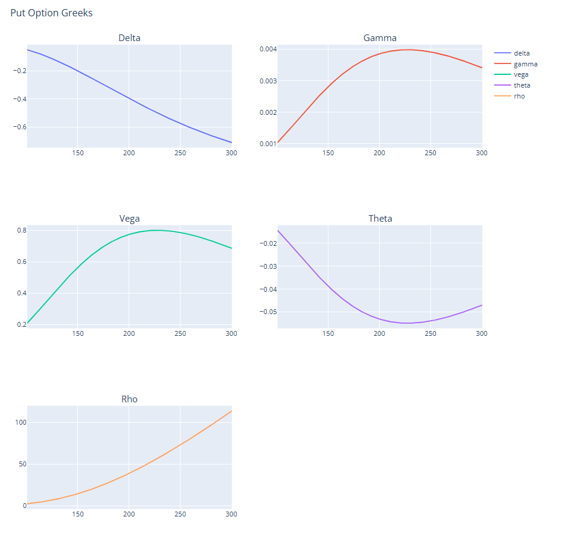
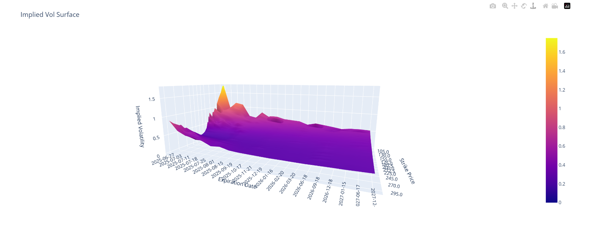

# Option Pricer – Real‑Time Option Analytics Dashboard

An interactive, production‑ready dashboard that brings professional option‑pricing analytics to your desktop. **Option Pricer** streams live market data, prices European options with the Black‑Scholes model, derives the full Greek profile, and visualises the entire implied‑volatility (IV) surface – all in one clean Dash + Plotly interface.

---

## Table of Contents

1. [Features](#features)
2. [Architecture](#architecture)
3. [Getting Started](#getting-started)
4. [Usage Guide](#usage-guide)
5. [Screenshots](#screenshots)
6. [Contributing](#contributing)
7. [Author & Acknowledgements](#author--acknowledgements)

---

## Features

* **Live Market Feed** – Pulls real‑time and historical data with `yfinance`.
* **Black‑Scholes Pricing Engine** – Computes fair value for European calls & puts.
* **Complete Greeks Suite** – Delta, Gamma, Vega, Theta & Rho plotted across strike space.
* **3‑D Implied‑Volatility Surface** – Fits and renders the IV surface (strike × expiry × IV).
* **Responsive Web UI** – Built with Dash & Plotly; every control is reactive (no page reloads).
* **Ready for Trading Desks** – Minimal latency, intuitive layout, and easily extensible hooks for order‑routing or risk engines.

---

## Architecture

```
┌────────────┐      live 🟢
│  Dash App  │◄─────────────────┐
└────────────┘                  │                       ┌──────────────┐
      │ callbacks & plots        │ REST/HTTP            │  yfinance /  │
      ▼                          └──────────────────────▶  market API   │
┌────────────┐                                           └──────────────┘
│  Pricing   │  Black‑Scholes
│  Engine    │  + Greeks
└────────────┘
```

* **Language**: Python 3.11
* **Major libs**: Dash, Plotly, pandas, NumPy, SciPy, yfinance

---

## Getting Started

```bash
# 1  Clone
$ git clone https://github.com/<your‑username>/option‑pricer.git
$ cd option‑pricer

# 2  Install deps (preferably inside venv)
$ pip install -r requirements.txt

# 3  Run
$ python app.py

# 4  Open
Navigate to http://127.0.0.1:8050 in your browser.
```

### Requirements

* Python ≥ 3.10
* An internet connection for live quotes

---

## Usage Guide

1. **Ticker** – enter any Yahoo Finance symbol (e.g. `AAPL`, `NVDA`, `SPY`).
2. **Strike** – desired strike price.
3. **Expiration** – choose expiry date (`YYYY‑MM‑DD`).
4. **Type** – `Call` or `Put`.
5. Hit **Submit**.

The dashboard returns:

* **Option Price** – theoretical Black‑Scholes value & last traded quote.
* **Historical Price Chart** – underlying’s recent performance.
* **Greeks Curves** – sensitivity vs. strike.
* **IV Surface** – 3‑D plot of implied vol across strikes/expiries.

---

## Screenshots

|   Main Dashboard   |   Greeks Panel  |              IV Surface             |
| :----------------: | :-------------: | :---------------------------------: |
|  |  |  |


---

## Contributing

Pull requests are welcome! Please open an issue first to discuss major changes.

1. Fork the repo
2. Create a feature branch (`git checkout -b feature/my‑feature`)
3. Commit & push (`git commit -m "Add ✨" && git push origin feature/my‑feature`)
4. Open a PR

---

## Author & Acknowledgements

**Author:** Thomas Tse

**Mentor:** Mitch Gao, Ph.D. – Director, Desk Quant (Unified Global Markets), UBS

> *Built with Coke Zero, code, and an unhealthy fascination with the Greeks.*
